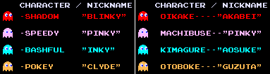

# Reinforced Pacman

This project is my attempt to make and train a deep-q network to play the original Pacman game. For reward flexibility and playing with different reward function, I decided to make the game itself from scratch.
I've experimented with various neural network architectures and data processing to get a beter understanding of tuning hyper parameters for training and preprocessing. These are all to be found below and appended to.

# Game Engine
For designing the game I decided to use the Simple and Fast Multimedia (SFML) library in c++. It is then integrated into python through building an API using pybind11. Only methods that are directly relevant to model training have been exported. These can be found in [binding.cpp](ui/bindings.cpp).

### Score Heurisitc:
Here I will outline how the score in the game works:
- Score is initalized at zero.
- Eating small pellets increases the score by 10. Large Pellets by 20.
- Eating large pellets places ghosts into frightened mode. Eating frightened ghosts increases the score by 200.
- The agent must eat all pellets to win the game.

### Ghost behavior:
Ghosts start in the ghost house with Blinky and Pinky awake at initalizaiton. Inky and Clyde are freed after Pacman has consumed 30 and 60 pellets, respectively. The only restriction in the ghosts movement is that they are unable to turn around. Here is a picture for ghost name reference:

The game consists of 5 states with distinct ghost behaviours:
1. Chase: differs for each Ghost. Described in detail below
2. Scatter: Each ghost has its specified scatter corner which it goes to when in this state. It can be seen with game initalization with the behaviour of Blinky and Pinky.
3. Frightened: Frightened ghosts' speed decreases by half and they take corners randomly. Once they collide with pacman they are set to Eaten state.
4. Eaten: Ghosts in this state are 1.5x as fast as Chase ghosts. They move back to the ghost house to be released in chase mode.
5. Sleep: Such ghosts have not yet been set free of the ghost house door, and will be so once the agent has eaten enough pellels. 

Each Ghost has a target which it's actively persuing in chase state:
- Blinky's target is pacman himself.
- Pinky's target is four tiles infront of the direction pacman is facing.
- Inky's target is a linear combination of Blinky and Pacman's position.
- Clyde's target is pacman but he switches to a scatter corner once he is closer than 8 tiles to pacman

The state of the game itself is set to have ghosts be in state chase for 20 seconds and scatter for 5, eating a power pellet restarts this condition. For a more detailed description of the rules, check [this](https://gameinternals.com/understanding-pac-man-ghost-behavior) out.

# Model Design:
### DeepQ Networks:
Q-learning is a reinforcement learning algorithm that teaches an agent how to act in an environment by assigning values to each action it might take (Q-values). Traditionaly, this is done through creating a q-table which maps each game state and action to a specific q-value. Thus, when making a decision given a game state, the agent chooses the immediate acton whcih leads to the maximum accumulation of a sequence of q-values that is to be followed on the table. While this approach is satisfactory for a game which can be represented through simple states, it does not scale well to complex environments like pacman. Hence, introducing the neural networks. 

The Neural network is to act as a q-function for us, giving us key values for every action given a game state. We then pick the aciton which seems to have the highest Q-value, we see how the game contiues and save the game's next state to be used with the action and correspondig state, as well as the reward for backpropagation. For a more detatailed explanation for how we evaluate the loss, take a look at [here](https://www.turing.com/kb/how-are-neural-networks-used-in-deep-q-learning).

### Model Architectures and inputs:

### Training Parameters:

| Model Name | Type | Episodes | Median Score | Learning Rate | Gamma | Batch Size | Sequence Length | Training time
| -------- | ------- | --------| -------------------| -------------| --------| --------|-------| ------
| CNN_5000  |  CNN    |
| RNN_5000 |  RNN    | 50000 |  550 | 1e-4  | 0.99 | 128 | 4 | Will see

### How to play Pacman
### how to train model
### how to load up model and see behaviouirs

